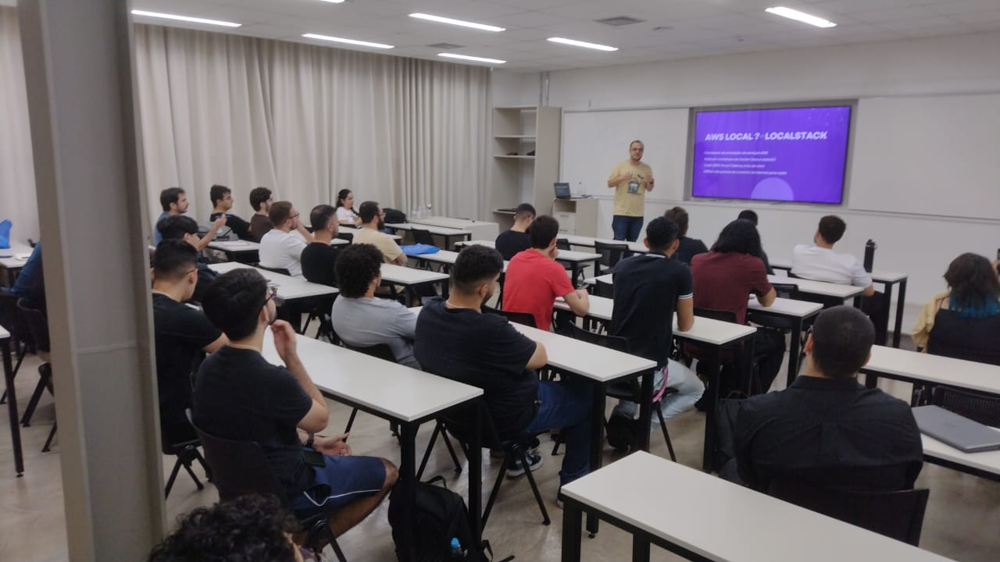
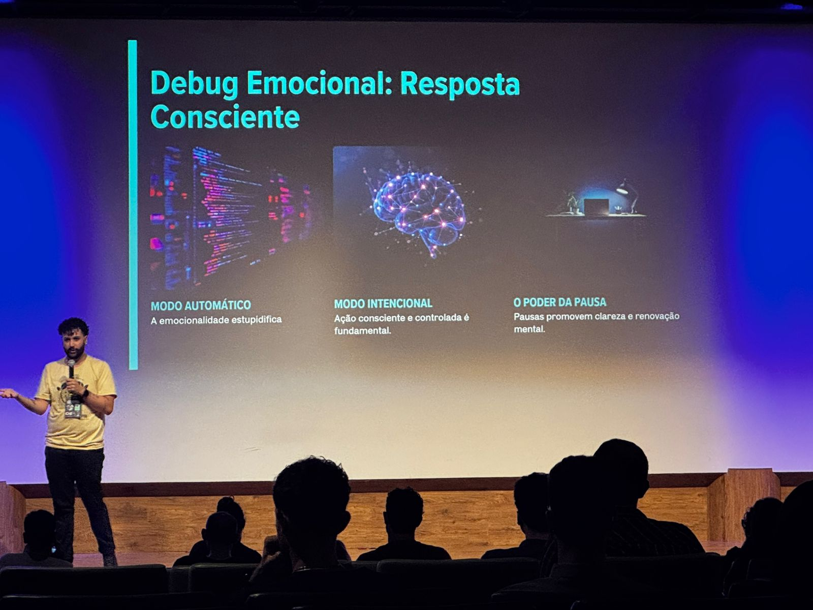
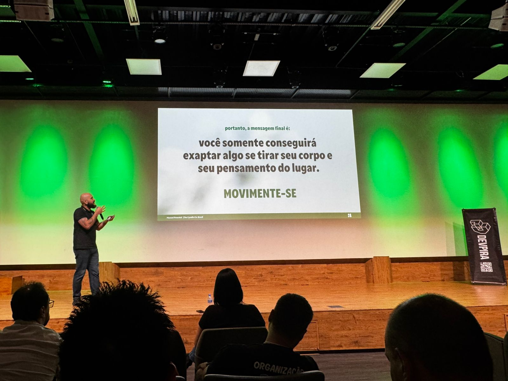
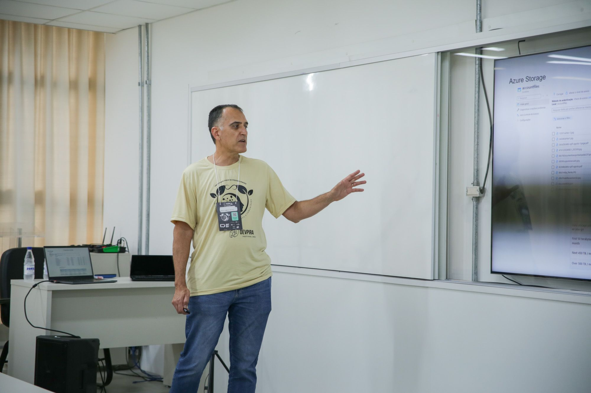
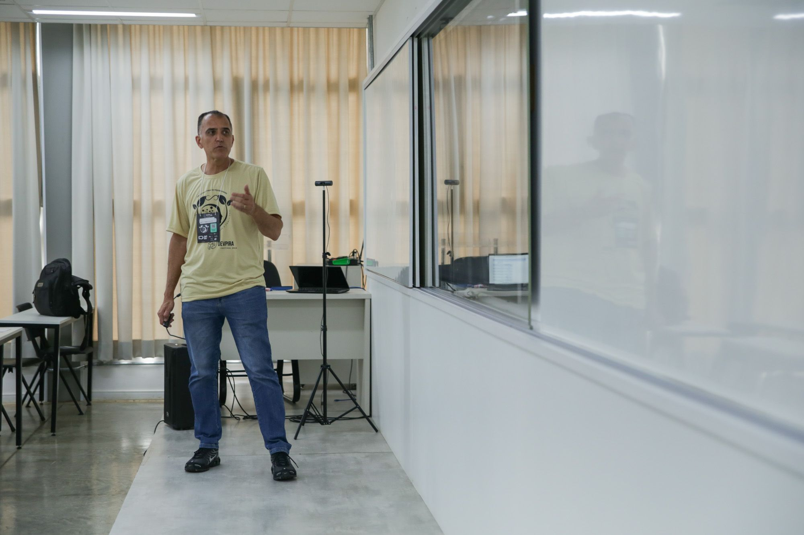
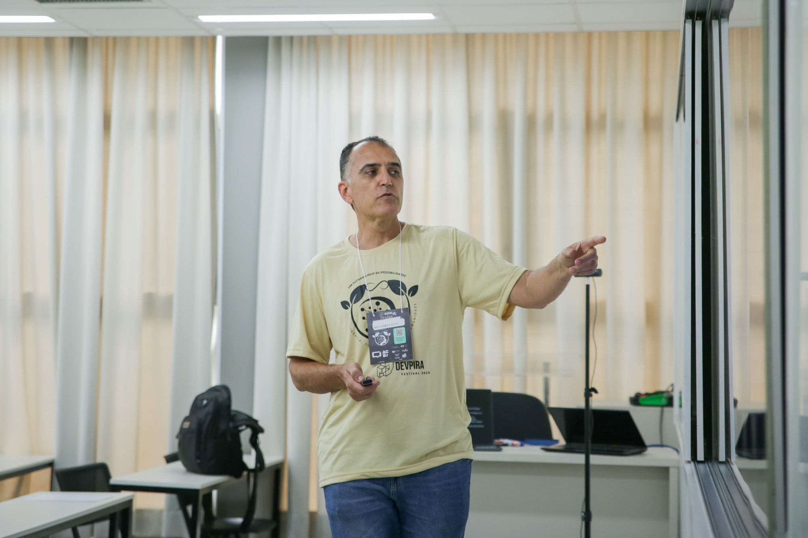
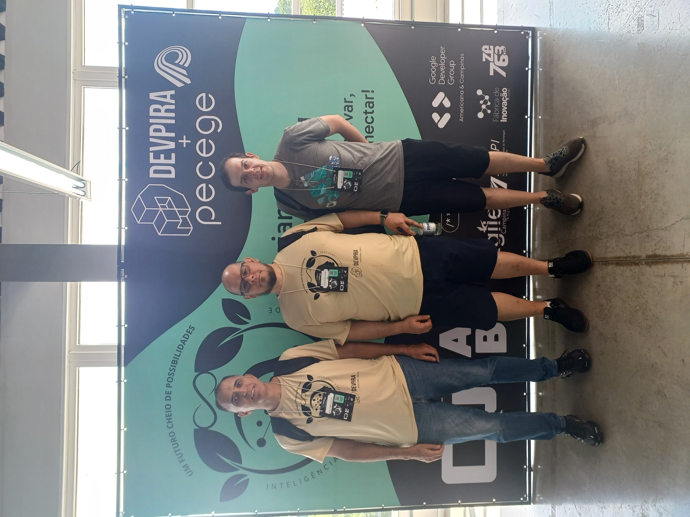

# DEVPIRA Festival 2025 – Palestra de Márcio Rogério Nizzola

## Sobre o evento
**Data:** 06 de dezembro de 2025  
**Local:** PECEGE – Piracicaba, SP  

O **DEVPIRA Festival** é o maior encontro anual da Comunidade DEVPIRA, reunindo desenvolvedores, designers, profissionais de carreira e agilidade, além de entusiastas da tecnologia.  
Em 2025, o festival trouxe ainda mais trilhas de palestras, networking com grandes nomes da inovação, stands interativos e o **Espaço Carreira**, dedicado a quem busca novas oportunidades profissionais.

---

## Palestra: Usando serviços de I.A. de fala e visão e criando aplicações inclusivas
**Palestrante:** Márcio Rogério Nizzola – Systems Architect, 3x MVP Microsoft, professor na Etec de Itu e fundador do Meetup Itu Developers.  

### Contexto
- Segundo o IBGE (2022), **3,6% da população brasileira** vive com algum tipo de deficiência visual, o que representa mais de **6,5 milhões de pessoas**.  
- Em pessoas acima de 60 anos, esse número chega a **11,5%**.  
- Muitos enfrentam dificuldades em tarefas simples como ler uma conta de luz ou bula de remédio.  
- A palestra destacou como **IA de fala e visão** pode ser aplicada para criar soluções inclusivas e acessíveis.

---

## Tecnologias apresentadas
### 🔹 Visão Computacional
- Classificação de imagens  
- Detecção de objetos  
- Segmentação semântica  
- Reconhecimento facial  
- OCR (Reconhecimento Óptico de Caracteres)

### 🔹 Inteligência de Fala
- Texto para fala (Text-to-Speech)  
- Fala para texto (Speech-to-Text)  
- Conversação em tempo real  
- Transcrição de áudio  
- Tradução automática  
- Avatares de fala  
- Comunicação multilíngue

### 🔹 Inteligência de Documentos
- Interpretação e análise de documentos digitais  
- Extração de dados estruturados  
- Resumo e explicação de conteúdos

---

## Projeto demonstrado
Um **Identificador de Documentos** que combina diferentes serviços da Azure para interpretar, resumir e responder perguntas sobre documentos enviados.  

**Serviços utilizados:**
- **Azure Document Intelligence** – análise de documentos com modelos predefinidos e personalizados  
- **Azure OpenAI** – interpretação e geração de conteúdo (ChatGPT, DALL-E)  
- **Azure Storage Blob** – armazenamento de arquivos e imagens  
- **Microsoft .NET + Azure Web App** – desenvolvimento da aplicação  

**Exemplo de uso prático:**
- Upload de documentos para o Azure Storage  
- Análise com Document Intelligence  
- Interpretação com Azure OpenAI  
- Respostas estruturadas em JSON para integração com sistemas

---

## Aplicações possíveis
- Pré-validação de documentos  
- Inserção automática de dados em sistemas  
- Explicação de documentos em áudio para idosos  
- Resumo de contratos e relatórios  
- Identificação visual de imagens  
- Integração com chatbots e assistentes de voz  

---

## Conclusão
A palestra de **Márcio Rogério Nizzola** mostrou como **IA de fala e visão** pode transformar a acessibilidade digital, criando soluções inclusivas que impactam milhões de pessoas.  
O projeto apresentado é um exemplo prático de como combinar serviços da **Azure** para resolver problemas reais e ampliar a inclusão tecnológica.

---
## Imagens do evento

---

## Referências
- [Azure Document Intelligence](https://learn.microsoft.com/pt-br/azure/ai-services/document-intelligence/?view=doc-intel-4.0.0)  
- [Azure OpenAI Service](https://azure.microsoft.com/pt-br/products/ai-services/openai-service)  
- [Azure SDK for .NET – OpenAI](https://github.com/Azure/azure-sdk-for-net/blob/Azure.AI.OpenAI_1.0.0-beta.6/sdk/openai/Azure.AI.OpenAI/README.md)  

---